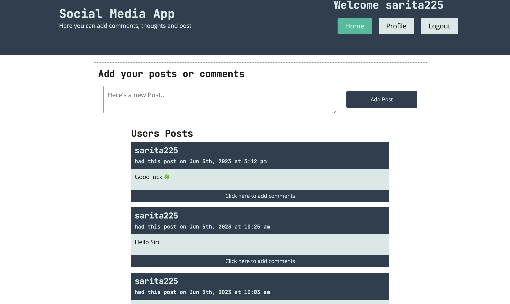

# social-media-app

An social media platform built using ReactJS, Material UI, Node, Express, MongoDB, JWT and Mongoose.
It is usefull for build a connection between peoples. You can create a post and comment

## Technology Used

    Client: React, Redux, Material UI and React Router.
    Server: Node, Express, MongoDB, Mongoose and JWT.

## screenshot
 